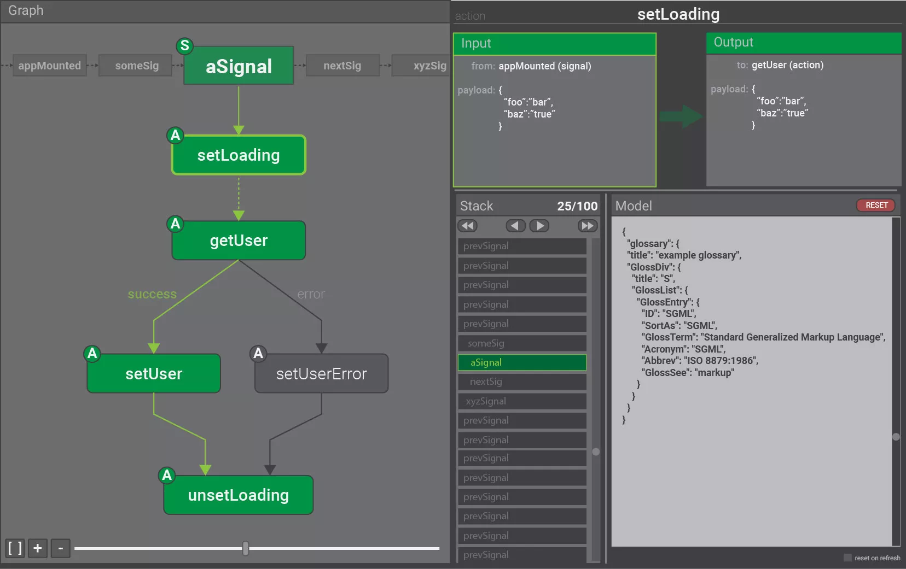

# cerebral-debugger-prototype
Prototype for the new debugger

## The goal
We want to build a new debugger with ideas from @delaneyj, as seen in this mockup:

There will be revisions to this mock, but you get the idea of the vision.

## Project structure
We want to make it possible to use the debugger in different environments.
We do this by pushing the state received from Cerebral down the top node
of the component. This component can be React, snabbdom, Angular etc.

In this boilerplate there is mocked state which represents a pretty complex
set of signals.

## Distribution
When one version of the debugger is ready (probably React) we will create update
it in the chrome extension repo and create a new one for the "in browser" version
of the debugger. Other view layers will also get their own repo.

## How to contribute
Fork this repo, team up with somebody else and build a prototype of the
debugger based on the mock-data provided. Lets us know on the Discord chatroom
when you have something to show :-)
